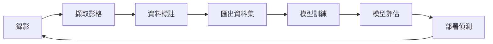

# 🍬 Candy Defect Detection System
# 糖果瑕疵影像偵測系統

[](https://www.python.org/)
[](https://opencv.org/)
[](https://github.com/ultralytics/ultralytics)
[](https://flask.palletsprojects.com/)
[](LICENSE)

基於 **YOLOv8** 與 **OpenCV** 的完整糖果瑕疵偵測解決方案，提供即時影像偵測、資料標註、模型訓練與 Web 管理介面。

## ✨ 功能特色

### 🎯 核心功能
- 🎥 **多攝影機即時偵測** - 支援同時監控多路攝影機，可獨立配置
- 🤖 **雙模型支援** - YOLOv8 (主推) / YOLOv4-tiny 靈活切換
- ⚡ **繼電器自動控制** - HTTP API 觸發，實現自動化分選
- 📊 **即時統計與歷史** - SQLite 資料庫記錄，支援匯出 CSV

### 🌐 Web 管理介面
- 🏠 **即時監控** - 雙攝影機畫面、偵測統計、GPU 使用率
- 🎥 **錄影管理** - 影片錄製、回放、格式轉換、批次處理
- 🏷️ **資料標註** - LabelImg 整合、AI 自動標註、重複圖片偵測
- 🤖 **模型訓練** - YOLOv8 訓練介面、即時進度監控、訓練曲線

### 🔧 進階功能
- 🎯 **ROI 區域偵測** - 自訂偵測區域，提升效能
- 📈 **效能監控** - FPS、GPU 記憶體、推論時間追蹤
- 🔄 **熱重載** - 設定變更無需重啟
- 📝 **完整日誌** - 多層級日誌系統，方便除錯

## 📁 專案結構

```
candy/
├── src/                          # 核心原始碼
│   ├── web_app.py               # Flask Web 應用主程式
│   ├── run_detector.py          # 即時偵測主程式
│   ├── video_recorder.py        # 影片錄製模組
│   └── yolov8_trainer.py        # YOLOv8 訓練模組
│
├── candy_detector/               # 核心套件模組
│   ├── config.py                # 設定載入
│   ├── logger.py                # 日誌系統
│   ├── models.py                # 資料模型
│   └── optimization.py          # 效能優化
│
├── scripts/                      # 訓練與資料處理腳本
│   ├── auto_labeling/           # 自動標註工具集
│   │   ├── auto_label_cv.py    # OpenCV 傳統視覺標註
│   │   ├── auto_label_sam.py   # SAM 模型標註
│   │   └── auto_label_*.py     # 其他標註方法
│   ├── train_yolo.py            # YOLOv8 訓練腳本
│   ├── train_yolo_large.py      # 大型模型訓練
│   └── prepare_yolo_dataset.py  # 資料集準備
│
├── tools/                        # 輔助工具集
│   ├── check_*.py               # 檢查工具（訓練資料、標註品質等）
│   ├── fix_*.py                 # 修復工具（標註問題等）
│   ├── generate_*.py            # 報告生成工具
│   ├── visualize_*.py           # 視覺化工具
│   └── merge_training_data.py   # 資料集合併
│
├── templates/                    # Web 介面模板
│   ├── index.html               # 首頁（即時監控）
│   ├── recorder.html            # 錄影管理
│   ├── annotate.html            # 資料標註
│   └── trainer.html             # 模型訓練
│
├── static/                       # 靜態資源
│   ├── annotate.js              # 標註介面邏輯
│   ├── recorder.js              # 錄影介面邏輯
│   └── trainer.js               # 訓練介面邏輯
│
├── datasets/                     # 資料集目錄
│   ├── extracted_frames/        # 擷取的影格
│   ├── annotated/               # 標註資料
│   └── candy/                   # YOLO 訓練資料集
│
├── models/                       # YOLOv4 模型檔案
├── runs/                         # YOLOv8 訓練結果
├── recordings/                   # 錄影檔案
├── logs/                         # 執行日誌
├── docs/                         # 專案文檔
│
├── config.ini                    # 系統設定檔
├── requirements.txt              # Python 套件依賴
├── .gitignore                    # Git 忽略清單
└── *.bat                         # Windows 啟動腳本
```

## 🚀 快速開始

### 1️⃣ 環境需求

- **Python 3.11+**
- **OpenCV 4.x**
- **(可選) CUDA 11.8+ / cuDNN** - GPU 加速訓練與推論
- **攝影機設備** - 支援 USB / IP Camera

### 2️⃣ 安裝

```bash
# 克隆專案
git clone https://github.com/Lei-TzuY/candy_detect.git
cd candy_detect

# 建立虛擬環境 (建議)
python -m venv .venv

# 啟用虛擬環境
.venv\Scripts\activate        # Windows
source .venv/bin/activate     # Linux/Mac

# 安裝依賴
pip install -r requirements.txt
```

### 3️⃣ 設定與執行

#### 🌐 方法 1：Web 介面 (推薦)

```bash
# 啟動 Web 應用
python src/web_app.py

# 或使用批次檔
start_all.bat              # Windows: 啟動 Web + 偵測
```

開啟瀏覽器訪問：`http://localhost:5000`

#### 💻 方法 2：命令列模式

```bash
# 單攝影機
python src/run_detector.py Camera1

# 雙攝影機
python src/run_detector.py Camera1 Camera2
```

### 4️⃣ 設定檔

編輯 `config.ini` 調整系統參數：

```ini
[Paths]
weights = runs/train/candy_detector/weights/best.pt  # YOLOv8 模型路徑
classes = models/classes.txt                          # 類別名稱

[Detection]
confidence_threshold = 0.5    # 置信度門檻
nms_threshold = 0.4           # NMS 門檻
input_size = 640              # 輸入尺寸

[Camera1]
index = 0                     # 攝影機索引
width = 1280                  # 解析度寬
height = 720                  # 解析度高
relay_url = http://192.168.1.100/relay/trigger  # 繼電器 API
```

## 📖 使用指南

### 🏠 Web 介面功能

#### 1. 首頁 - 即時監控
- ✅ 雙攝影機即時畫面
- ✅ 偵測統計（良品/瑕疵/瑕疵率）
- ✅ 系統狀態監控
- ✅ 繼電器控制測試

#### 2. 🎥 錄影管理
- ✅ 影片錄製與停止
- ✅ 錄影列表與回放
- ✅ 影片轉檔 (XVID/MJPG/H264)
- ✅ 擷取訓練影格
- ✅ 批次刪除管理

#### 3. 🏷️ 資料標註

**Web 介面標註** (推薦)
- ✅ LabelImg 風格標註介面
- ✅ AI 自動標註 (YOLOv8)
- ✅ 批次處理與篩選
- ✅ 重複圖片偵測
- ✅ 空白圖片檢測
- ✅ 極端標記框過濾
- ✅ 標註資料匯出

**獨立 LabelImg 工具**
```powershell
# 快速啟動 LabelImg
.\start_labelimg.ps1

# 或從 LabelImg 目錄啟動
cd LabelImg
.\run_labelimg.ps1
```

#### 4. 🤖 模型訓練
- ✅ YOLOv8 訓練介面
- ✅ 即時訓練進度
- ✅ 訓練曲線顯示
- ✅ GPU 使用率監控
- ✅ 模型評估與測試

### 📊 工作流程



1. **錄影** → 在實驗室/工廠錄製糖果影片
2. **擷取影格** → 從影片中擷取訓練用的影像
3. **資料標註** → 手動標註或 AI 輔助標註
4. **匯出資料集** → 轉換為 YOLO 訓練格式
5. **模型訓練** → YOLOv8 訓練新模型
6. **模型評估** → 測試模型性能
7. **部署偵測** → 使用新模型進行即時偵測

## 🔌 API 文檔

### 模型管理
- `GET /api/models` - 列出所有可用模型
- `GET /api/models/current` - 取得目前使用的模型
- `POST /api/models/change` - 切換模型

### 訓練管理
- `POST /api/training/start` - 開始訓練
- `GET /api/training/status` - 取得訓練狀態
- `POST /api/training/stop` - 停止訓練
- `GET /api/training/models` - 列出已訓練的模型

### 資料管理
- `POST /api/annotate/export` - 匯出標註資料集
- `POST /api/annotate/extract_frames` - 從影片擷取影格
- `POST /api/annotate/detect_duplicates` - 偵測重複圖片
- `POST /api/annotate/auto_label` - AI 自動標註

### 統計與歷史
- `GET /api/stats` - 即時統計
- `GET /api/history` - 歷史紀錄查詢
- `GET /api/history/export` - 匯出 CSV

## 🛠️ 技術架構

### 核心技術
- **深度學習**: YOLOv8 (Ultralytics) / YOLOv4-tiny (Darknet)
- **影像處理**: OpenCV 4.x
- **Web 框架**: Flask 3.x
- **資料庫**: SQLite 3
- **前端**: Vanilla JavaScript + Axios

### 系統架構

```
┌─────────────────────────────────────────────┐
│              Web Browser (Port 5000)        │
│     首頁 │ 錄影 │ 標註 │ 訓練                │
└──────────────────┬──────────────────────────┘
                   │ HTTP/WebSocket
┌──────────────────▼──────────────────────────┐
│            Flask Web Server                  │
│  ┌────────────┬────────────┬──────────────┐ │
│  │ Detection  │ Recorder   │ Trainer      │ │
│  │ Manager    │ Manager    │ Manager      │ │
│  └────────────┴────────────┴──────────────┘ │
└──────────────────┬──────────────────────────┘
                   │
┌──────────────────▼──────────────────────────┐
│         YOLOv8 / OpenCV Layer               │
│  ┌────────────────────────────────────────┐ │
│  │  Model Inference │ Video Capture       │ │
│  │  Image Processing│ Recording           │ │
│  └────────────────────────────────────────┘ │
└──────────────────┬──────────────────────────┘
                   │
┌──────────────────▼──────────────────────────┐
│     Hardware (Camera, GPU, Relay)           │
└─────────────────────────────────────────────┘
```

## 📝 開發指南

### 新增攝影機

在 `config.ini` 增加新的攝影機區塊：

```ini
[Camera3]
index = 2
width = 1920
height = 1080
relay_url = http://192.168.1.103/relay/trigger
relay_delay_ms = 100
```

### 自訂類別

編輯 `models/classes.txt`：

```txt
good
defect_crack
defect_spot
defect_broken
```

### 擴充功能

核心模組都在 `src/` 和 `candy_detector/` 目錄：

- 新增偵測邏輯 → `src/run_detector.py`
- 新增 API 端點 → `src/web_app.py`
- 修改訓練流程 → `src/yolov8_trainer.py`

## 📚 相關文檔

詳細文檔請參閱 [`docs/`](docs/) 資料夾：

- 📖 [BAT 腳本指南](docs/BAT_SCRIPTS_GUIDE.md)
- 🔧 [視訊編碼選擇](docs/video_codec_selector.md)
- 🏭 [部署指南](docs/deployment/)
- ⚡ [效能優化](docs/optimization/)

## ⚠️ 注意事項

1. **模型檔案**: `.pt` / `.weights` 檔案未包含在版本庫中（檔案過大），請自行訓練或下載
2. **資料集**: `datasets/` 目錄已加入 `.gitignore`，不會上傳到 Git
3. **GPU 支援**: 需要安裝 CUDA 與 cuDNN，PyTorch 會自動偵測
4. **攝影機權限**: Linux 系統可能需要將使用者加入 `video` 群組

## 🤝 貢獻指南

歡迎提交 Issue 和 Pull Request！

### 開發流程

1. Fork 本專案
2. 建立您的功能分支 (`git checkout -b feature/AmazingFeature`)
3. 提交您的變更 (`git commit -m 'Add some AmazingFeature'`)
4. 推送到分支 (`git push origin feature/AmazingFeature`)
5. 開啟 Pull Request

### 程式碼風格

- Python: 遵循 PEP 8
- JavaScript: 使用 ESLint 建議配置
- 註解: 重要函式請加上 docstring

## 📄 授權

本專案採用 MIT 授權條款 - 詳見 [LICENSE](LICENSE) 檔案

## 👤 作者

- **Lei-TzuY** - [GitHub](https://github.com/Lei-TzuY)

## 🙏 致謝

- [Ultralytics YOLOv8](https://github.com/ultralytics/ultralytics) - YOLO 模型框架
- [OpenCV](https://opencv.org/) - 影像處理函式庫
- [Flask](https://flask.palletsprojects.com/) - Web 框架
- [LabelImg](https://github.com/heartexlabs/labelImg) - 標註工具靈感

## 📞 聯絡方式

如有問題或建議，歡迎透過以下方式聯絡：

- 📧 Email: your-email@example.com
- 💬 GitHub Issues: [提出問題](https://github.com/Lei-TzuY/candy_detect/issues)

---

<p align="center">
  <strong>Made with ❤️ for intelligent candy quality control</strong>
</p>

<p align="center">
  ⭐ 如果這個專案對您有幫助，請給一顆星星！ ⭐
</p>
