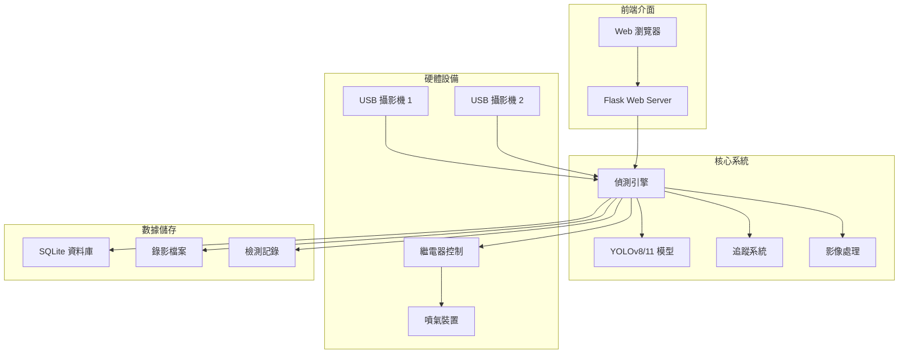
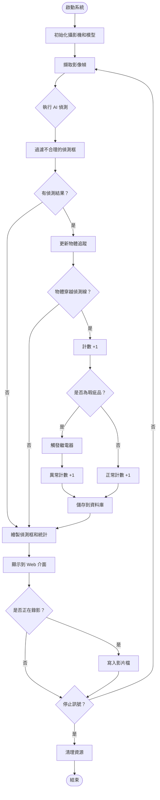
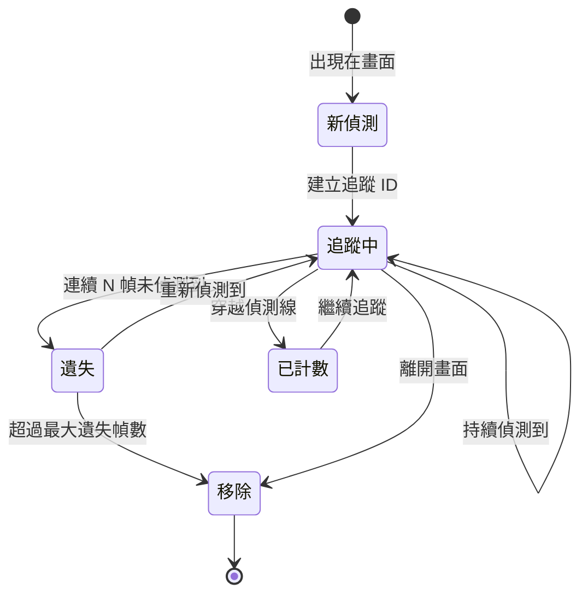
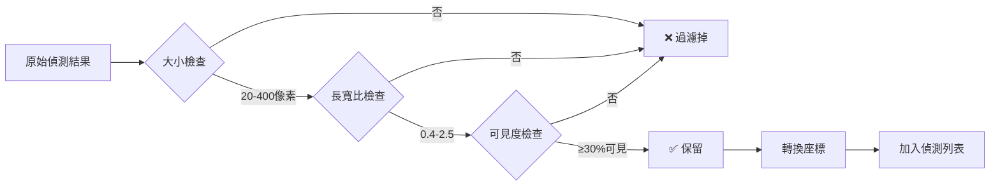

# 🍬 糖果瑕疵偵測系統 - 使用手冊

**版本：** v1.0.0  
**日期：** 2026-01-28  
**適用對象：** 廠商操作人員、維護人員

---

## 📑 目錄

1. [系統概述](#系統概述)
2. [系統架構](#系統架構)
3. [安裝與設定](#安裝與設定)
4. [基本操作](#基本操作)
5. [進階功能](#進階功能)
6. [檢測流程](#檢測流程)
7. [常見問題](#常見問題)
8. [維護指南](#維護指南)
9. [故障排除](#故障排除)

---

## 系統概述

### 系統功能
糖果瑕疵偵測系統是一個基於 AI 視覺辨識的品質檢測系統，能夠：

- ✅ **即時偵測**：自動識別糖果表面瑕疵
- 🎯 **自動分類**：區分正常糖果與瑕疵糖果
- 🔧 **自動剔除**：觸發繼電器自動移除瑕疵品
- 📊 **數據統計**：記錄並分析檢測數據
- 📹 **影像錄製**：保存檢測過程影像供後續分析

### 技術規格

| 項目 | 規格 |
|------|------|
| 攝影機解析度 | 1920×1080 (Full HD) |
| 檢測速度 | 約 30 FPS |
| AI 模型 | YOLOv8 / YOLO11 |
| 信心度閾值 | 60% (可調整) |
| 支援攝影機數量 | 最多 2 台 |
| 作業系統 | Windows 10/11 |

---

## 系統架構

### 整體架構圖



### 檔案結構

```
candy_detect/
├── src/                      # 核心程式碼
│   ├── web_app.py           # Web 伺服器
│   ├── run_detector.py      # 偵測引擎
│   └── video_recorder.py    # 錄影模組
├── candy_detector/           # 偵測器模組
│   ├── models.py            # 資料模型
│   ├── config.py            # 配置管理
│   └── constants.py         # 常數定義
├── static/                   # 前端資源
│   ├── script.js            # JavaScript
│   └── style.css            # 樣式表
├── templates/                # HTML 模板
│   ├── index.html           # 主頁面
│   └── trainer.html         # 訓練頁面
├── models/                   # AI 模型檔案
├── datasets/                 # 訓練資料集
├── recordings/               # 錄影檔案
├── logs/                     # 系統日誌
├── config.ini               # 主要配置檔
├── start_all.bat            # 啟動腳本
└── requirements.txt         # Python 套件清單
```

---

## 安裝與設定

### 🔧 系統需求

#### 硬體需求
- CPU: Intel i5 或以上 (建議 i7)
- RAM: 8GB 以上 (建議 16GB)
- GPU: NVIDIA GPU (可選，用於加速)
- 儲存空間: 50GB 以上
- USB 3.0 接口: 2 個以上

#### 軟體需求
- Windows 10/11 (64-bit)
- Python 3.8-3.11
- CUDA 11.8+ (如使用 GPU)
- Git (用於版本控制)

### 📦 安裝步驟

#### 1. 安裝 Python
```powershell
# 下載並安裝 Python 3.10
# 網址: https://www.python.org/downloads/
# ⚠️ 安裝時勾選 "Add Python to PATH"
```

#### 2. 克隆專案
```powershell
# 從 GitHub 下載專案
git clone https://github.com/Lei-TzuY/candy_detect.git
cd candy_detect
```

#### 3. 安裝 Python 套件
```powershell
# 安裝所有必要套件
pip install -r requirements.txt
```

#### 4. 配置攝影機和繼電器

編輯 `config.ini` 檔案：

```ini
[Camera1]
camera_index = 0              # 攝影機編號 (0, 1, 2...)
camera_name = Camera 1        # 顯示名稱
frame_width = 1920           # 解析度寬度
frame_height = 1080          # 解析度高度
relay_url = http://localhost:8080/api/relay/Relay2?value=1  # 繼電器 API
detection_line_x1 = 500      # 偵測線起點
detection_line_x2 = 1100     # 偵測線終點
exposure_value = -7          # 曝光值
default_focus = 80           # 預設焦距

[Detection]
confidence_threshold = 0.6   # 信心度閾值 (0.0-1.0)
nms_threshold = 0.45        # NMS 閾值
```

#### 5. 準備 AI 模型

將訓練好的模型檔案放置在專案根目錄：
- `yolov8n.pt` (小型模型)
- `yolov8s.pt` (中型模型)
- `yolov8m.pt` (大型模型)
- 或自訓練模型放在 `models/` 資料夾

---

## 基本操作

### 🚀 啟動系統

#### 方法 1: 使用批次檔 (建議)
```powershell
# 雙擊執行
start_all.bat
```

#### 方法 2: 手動啟動
```powershell
# 啟動 Web 服務
python src/web_app.py

# 在瀏覽器開啟
# http://localhost:5000
```

### 🖥️ Web 介面操作

#### 主控台介面

![主控台示意圖]

**介面說明：**

```
┌──────────────────────────────────────────────────────────────┐
│ 🍬 糖果瑕疵偵測系統                                            │
│ 📊 儀表板 | 📜 歷史記錄 | ⚙️ 系統設定                          │
├──────────────────────────────────────────────────────────────┤
│ 🎥 錄影 | 🤖 訓練 | 🏷️ 標註 | 🔄 | 🌙 | A- 重設 A+ |         │
├──────────────────────────────────────────────────────────────┤
│ ⏸️ 暫停所有鏡頭  🔍 重新偵測鏡頭                               │
│                                                              │
│ 新增攝影機: [-- 選擇攝影機 --▼]  ➕ 新增                      │
│ 🤖 模型版本: [yolo11m (38.8MB) | 2026-01-26 14:14 ▼] 當前使用│
├──────────────────────────────────────────────────────────────┤
│ ┌───────────────────────────┐ ┌───────────────────────────┐ │
│ │ Camera 1                  │ │ Camera 2                  │ │
│ │ 切換來源: [來源 0 (當前)▼] │ │ 切換來源: [來源 1 (當前)▼] │ │
│ │ ⏸️ 暫停  ❌ 移除           │ │ ⏸️ 暫停  ❌ 移除           │ │
│ │                           │ │                           │ │
│ │ ┌─────────────────────┐  │ │ ┌─────────────────────┐  │ │
│ │ │                     │  │ │ │                     │  │ │
│ │ │  即時影像顯示區      │  │ │ │  即時影像顯示區      │  │ │
│ │ │  (帶偵測框)         │  │ │ │  (帶偵測框)         │  │ │
│ │ └─────────────────────┘  │ │ └─────────────────────┘  │ │
│ │                           │ │                           │ │
│ │ 📊 統計資訊:              │ │ 📊 統計資訊:              │ │
│ │ 總偵測數: 1               │ │ 總偵測數: 0               │ │
│ │ ✅ 正常品: 0              │ │ ✅ 正常品: 0              │ │
│ │ ❌ 瑕疵品: 1              │ │ ❌ 瑕疵品: 0              │ │
│ │ 瑕疵率: 100%              │ │ 瑕疵率: 0%                │ │
│ │                           │ │                           │ │
│ │ 🎮 控制選項:              │ │ 🎮 控制選項:              │ │
│ │ 🚫 關閉標記框              │ │ 🚫 關閉標記框              │ │
│ │ 💨 測試噴氣                │ │ 💨 測試噴氣                │ │
│ │ ⏸️ 暫停噴氣               │ │ ⏸️ 暫停噴氣               │ │
│ │                           │ │                           │ │
│ │ ⚙️ 參數調整:              │ │ ⚙️ 參數調整:              │ │
│ │ 🎯 焦距: [▭▭▭●▭▭] 128    │ │ 🎯 焦距: [▭▭▭●▭▭] 127    │ │
│ │ 📸 曝光: [▭●▭▭▭▭] -7     │ │ 📸 曝光: [▭▭●▭▭▭] -4     │ │
│ │ ⏱️ 噴氣延遲: [▭▭▭▭●▭]    │ │ ⏱️ 噴氣延遲: [▭▭▭▭●▭]    │ │
│ │    1600 ms                │ │    1600 ms                │ │
│ └───────────────────────────┘ └───────────────────────────┘ │
├──────────────────────────────────────────────────────────────┤
│ 📈 即時圖表                                                   │
│ ┌──────────────────────────┐ ┌──────────────────────────┐  │
│ │ 瑕疵率趨勢                │ │ 產品分布                 │  │
│ │ (折線圖)                 │ │ (圓餅圖)                 │  │
│ └──────────────────────────┘ └──────────────────────────┘  │
└──────────────────────────────────────────────────────────────┘
```

**介面區域說明：**

**1️⃣ 頂部導航列**
- 📊 **儀表板**：主控台頁面（當前頁）
- 📜 **歷史記錄**：查看過往檢測記錄
- ⚙️ **系統設定**：配置系統參數

**2️⃣ 功能工具列**
- 🎥 **錄影**：開始/停止錄製影片
- 🤖 **訓練**：進入模型訓練頁面
- 🏷️ **標註**：開啟資料標註工具
- 🔄 **重新整理**：刷新頁面
- 🌙 **深色模式**：切換明/暗主題
- **A- / 重設 / A+**：調整字體大小

**3️⃣ 全域控制區**
- ⏸️ **暫停所有鏡頭**：一鍵暫停所有攝影機的偵測
- 🔍 **重新偵測鏡頭**：自動搜尋可用攝影機
- **新增攝影機**：從下拉選單選擇並新增攝影機
- 🤖 **模型版本選擇**：切換不同的 YOLO 模型

**4️⃣ 攝影機卡片（每個攝影機獨立）**

*4.1 卡片標題列*
- **Camera N**：攝影機名稱
- **切換來源**：切換不同的攝影機索引
- ⏸️ **暫停**：暫停該攝影機
- ❌ **移除**：移除該攝影機

*4.2 即時影像區*
- 顯示攝影機即時畫面
- 綠框：正常糖果
- 紅框：瑕疵糖果
- 藍色偵測線：計數觸發線

*4.3 統計資訊*
- **總偵測數**：通過偵測線的糖果總數
- **正常品**：判定為正常的數量
- **瑕疵品**：判定為瑕疵的數量
- **瑕疵率**：瑕疵品佔總數的百分比

*4.4 控制選項*
- 🚫 **關閉標記框**：隱藏偵測框（僅顯示原始畫面）
- 💨 **測試噴氣**：手動觸發繼電器測試
- ⏸️ **暫停噴氣**：暫停自動剔除功能

*4.5 參數調整*
- 🎯 **焦距** (0-255)：調整攝影機焦距，影響清晰度
- 📸 **曝光** (-13 到 0)：調整曝光值，影響亮度
- ⏱️ **噴氣延遲** (0-3000ms)：瑕疵品觸發噴氣的延遲時間

**5️⃣ 即時圖表區**
- 📈 **瑕疵率趨勢**：折線圖顯示瑕疵率變化
- 🥧 **產品分布**：圓餅圖顯示正常/瑕疵比例

#### 操作步驟

**步驟 1: 選擇攝影機**
1. 點擊 **🔍 偵測攝影機** 按鈕
2. 系統會自動搜尋可用的攝影機
3. 從下拉選單選擇要使用的攝影機

**步驟 2: 選擇 AI 模型**
1. 從模型下拉選單選擇模型
   - `yolov8n`: 速度快，準確度中等
   - `yolov8s`: 速度中等，準確度較高
   - `yolov8m`: 速度較慢，準確度最高
   - `yolo11n/s/m`: YOLO11 系列

**步驟 3: 調整攝影機參數**
1. **焦距調整**：拖曳滑桿調整清晰度
   - 範圍：0-255
   - 建議值：70-90
   - 調整後會自動儲存

2. **曝光調整**：拖曳滑桿調整亮度
   - 範圍：-13 到 0
   - 建議值：-7 到 -5
   - 調整後會自動儲存

**步驟 4: 開始偵測**
1. 點擊 **▶️ 開始偵測** 按鈕
2. 畫面開始顯示即時偵測結果
3. 觀察統計數據是否正常更新

**步驟 5: 監控運行**
- 觀察偵測框是否準確框住糖果
- 檢查分類結果（綠框=正常，紅框=異常）
- 注意計數是否正確累加
- 確認異常品是否觸發噴氣

**步驟 6: 停止偵測**
1. 點擊 **⏹️ 停止偵測** 按鈕
2. 系統會儲存最後的統計數據
3. 可以重新開始或切換攝影機

### 📹 錄影功能

#### 開始錄影
```
1. 點擊 "🎥 開始錄影" 按鈕
2. 選擇錄影品質:
   - 高品質 (1920×1080, 30fps)
   - 標準品質 (1280×720, 30fps)
   - 低品質 (640×480, 30fps)
3. 錄影檔案自動儲存到 recordings/ 資料夾
```

#### 停止錄影
```
1. 點擊 "⏹️ 停止錄影" 按鈕
2. 系統自動保存影片
3. 檔名格式: camera_YYYYMMDD_HHMMSS.mp4
```

### 📷 截圖功能

```
1. 點擊 "📷 截圖" 按鈕
2. 截圖自動儲存到 recordings/screenshots/ 資料夾
3. 檔名格式: screenshot_YYYYMMDD_HHMMSS.jpg
```

---

## 進階功能

### 🎓 模型訓練

#### 訓練新模型

1. **準備訓練資料**
   ```
   datasets/
   ├── images/
   │   ├── train/
   │   └── val/
   └── labels/
       ├── train/
       └── val/
   ```

2. **開啟訓練頁面**
   - 在 Web 介面點擊 "🎓 模型訓練"
   - 或瀏覽 http://localhost:5000/trainer

3. **設定訓練參數**
   ```
   模型版本: YOLOv8n (快速訓練)
   訓練輪數: 100 epochs
   批次大小: 16
   影像大小: 640
   資料集路徑: datasets/candy_dataset.yaml
   ```

4. **開始訓練**
   - 點擊 "開始訓練" 按鈕
   - 訓練時間視資料量而定（通常 2-8 小時）
   - 訓練完成後模型儲存在 `runs/detect/train/weights/best.pt`

### 📊 歷史記錄查詢

#### 查看檢測記錄
```
1. 點擊 "📊 檢測記錄" 按鈕
2. 選擇查詢條件:
   - 日期範圍
   - 攝影機名稱
   - 異常比例
3. 點擊 "查詢" 顯示結果
4. 可匯出為 CSV 檔案
```

#### 資料庫位置
```
檔案: detection_data.db
位置: 專案根目錄
格式: SQLite 資料庫
```

### ⚙️ 系統設定

#### 調整檢測參數

編輯 `config.ini` 中的 `[Detection]` 區段：

```ini
[Detection]
# 信心度閾值 (0.0-1.0)
# 數值越高，誤判越少，但可能漏檢
confidence_threshold = 0.6

# NMS 閾值 (0.0-1.0)
# 用於過濾重疊的偵測框
nms_threshold = 0.45

# 是否使用多尺度檢測 (0 或 1)
# 啟用可提高小物體檢測率，但速度較慢
use_multi_scale = 1

# 多尺度因子 (逗號分隔)
multi_scale_factors = 0.75,1.0,1.25
```

#### 調整偵測線位置

```ini
[Camera1]
# 偵測線的 X 座標範圍
# 只有穿越此線的物體才會被計數
detection_line_x1 = 500
detection_line_x2 = 1100
```

---

## 檢測流程

### 完整檢測流程圖



### 物體追蹤邏輯



### 偵測框過濾流程



---

## 常見問題

### ❓ FAQ

#### Q1: 系統無法啟動，顯示 "找不到模型檔案"
**A:** 
```
解決方法:
1. 確認根目錄有 yolov8n.pt 或其他模型檔案
2. 檢查 config.ini 中的 weights 路徑是否正確
3. 如果沒有模型，可以從以下位置下載:
   - https://github.com/ultralytics/assets/releases
```

#### Q2: 偵測框位置不準確
**A:**
```
可能原因:
1. 焦距未調整好 → 調整焦距滑桿
2. 曝光過亮或過暗 → 調整曝光值
3. 模型訓練資料不足 → 重新訓練模型
4. 信心度閾值過低 → 在 config.ini 提高 confidence_threshold
```

#### Q3: 有些糖果沒有被計數
**A:**
```
可能原因:
1. 糖果沒有穿越偵測線
   → 調整 detection_line_x1 和 detection_line_x2 範圍

2. 偵測框被過濾掉
   → 檢查糖果是否符合過濾條件 (大小、長寬比)

3. 追蹤丟失
   → 增加 MAX_MISSED_FRAMES 參數值
```

#### Q4: 繼電器沒有觸發
**A:**
```
檢查項目:
1. relay_url 設定是否正確
2. 繼電器控制器是否正常運作
3. 是否點擊了 "⏸️ 暫停噴氣" 按鈕
4. 檢查 relay_delay_ms 延遲設定
```

#### Q5: 錄影檔案太大
**A:**
```
優化方法:
1. 降低錄影解析度 (1080p → 720p)
2. 調整影片編碼器品質參數
3. 定期清理 recordings/ 資料夾
4. 只在需要時才錄影
```

#### Q6: 系統運行緩慢
**A:**
```
優化建議:
1. 使用較小的模型 (yolov8n 代替 yolov8m)
2. 降低攝影機解析度 (1080p → 720p)
3. 關閉多尺度檢測 (use_multi_scale = 0)
4. 如有 GPU，確保 CUDA 已正確安裝
5. 關閉不必要的後台程式
```

---

## 維護指南

### 🔧 日常維護

#### 每日檢查
- [ ] 檢查攝影機鏡頭是否清潔
- [ ] 確認焦距和曝光設定正常
- [ ] 查看統計數據是否合理
- [ ] 檢查磁碟空間是否充足

#### 每週維護
- [ ] 清理 recordings/ 資料夾的舊影片
- [ ] 清理 logs/ 資料夾的舊日誌
- [ ] 備份 detection_data.db 資料庫
- [ ] 檢查系統日誌是否有異常

#### 每月維護
- [ ] 更新 Python 套件: `pip install -r requirements.txt --upgrade`
- [ ] 檢查模型準確度是否下降
- [ ] 清理 __pycache__ 資料夾
- [ ] 備份整個專案資料夾

### 💾 資料備份

#### 重要檔案清單
```
必須備份:
├── config.ini              # 配置檔
├── detection_data.db       # 檢測記錄資料庫
├── focus_settings.json     # 焦距設定
├── models/                 # 自訓練的模型
└── datasets/               # 訓練資料集

建議備份:
├── recordings/             # 錄影檔案
├── logs/                   # 系統日誌
└── runs/                   # 訓練結果
```

#### 備份指令
```powershell
# 建立備份資料夾
$date = Get-Date -Format "yyyyMMdd"
$backupDir = "backup_$date"
New-Item -ItemType Directory -Path $backupDir

# 複製重要檔案
Copy-Item config.ini $backupDir/
Copy-Item detection_data.db $backupDir/
Copy-Item focus_settings.json $backupDir/
Copy-Item -Recurse models/ $backupDir/models/

# 壓縮備份
Compress-Archive -Path $backupDir -DestinationPath "$backupDir.zip"
```

### 📊 效能監控

#### 系統效能指標

| 指標 | 正常範圍 | 異常情況 |
|------|---------|---------|
| FPS | 25-30 | < 20 |
| CPU 使用率 | 40-70% | > 90% |
| 記憶體使用 | 2-4 GB | > 6 GB |
| 偵測延遲 | < 50ms | > 100ms |

#### 檢查系統效能
```powershell
# 檢查 Python 進程
Get-Process python | Select-Object CPU, WorkingSet, ProcessName

# 查看磁碟空間
Get-PSDrive C | Select-Object Used, Free

# 檢查網路連線
Test-NetConnection localhost -Port 5000
```

---

## 故障排除

### 🚨 常見錯誤處理

#### 錯誤 1: "攝影機無法開啟"
```
錯誤訊息: "無法向 Camera 1 取得畫面"

解決步驟:
1. 檢查 USB 連線是否穩固
2. 確認 config.ini 中的 camera_index 正確
3. 關閉其他可能佔用攝影機的程式
4. 重新插拔 USB 攝影機
5. 在裝置管理員檢查攝影機驅動
```

#### 錯誤 2: "模型載入失敗"
```
錯誤訊息: "Error loading model"

解決步驟:
1. 確認模型檔案存在且未損壞
2. 檢查 ultralytics 套件版本是否相容
3. 嘗試重新下載模型檔案
4. 查看 logs/ 資料夾的詳細錯誤訊息
```

#### 錯誤 3: "資料庫錯誤"
```
錯誤訊息: "database is locked"

解決步驟:
1. 關閉所有訪問資料庫的程式
2. 刪除 detection_data.db-wal 和 -shm 檔案
3. 重新啟動系統
4. 如果問題持續，備份後刪除 detection_data.db
```

#### 錯誤 4: "記憶體不足"
```
錯誤訊息: "Out of memory"

解決步驟:
1. 使用較小的模型 (yolov8n)
2. 降低攝影機解析度
3. 關閉多尺度檢測
4. 增加系統記憶體
5. 關閉其他佔用記憶體的程式
```

### 🔄 系統重置

#### 重置設定
```powershell
# 備份當前設定
Copy-Item config.ini config.ini.backup

# 重置為預設值
# 手動編輯 config.ini，參考預設值
```

#### 重置資料庫
```powershell
# 備份資料庫
Copy-Item detection_data.db detection_data.db.backup

# 刪除並重建
Remove-Item detection_data.db
# 重新啟動系統會自動建立新資料庫
```

#### 完全重置
```powershell
# ⚠️ 警告: 此操作會刪除所有記錄和設定

# 1. 備份重要檔案
$backup = "full_backup_$(Get-Date -Format 'yyyyMMdd_HHmmss')"
New-Item -ItemType Directory -Path $backup
Copy-Item config.ini, detection_data.db, focus_settings.json $backup/

# 2. 刪除快取和記錄
Remove-Item -Recurse -Force __pycache__, logs/*, recordings/*

# 3. 重置設定檔
# 手動還原 config.ini 為預設值

# 4. 重新啟動
.\start_all.bat
```

---

## 📞 技術支援

### 聯絡資訊
- **GitHub 專案**: https://github.com/Lei-TzuY/candy_detect
- **問題回報**: 在 GitHub Issues 提出問題
- **文件更新**: 參考 CHANGELOG.md

### 日誌收集
當需要技術支援時，請提供以下資訊：

```powershell
# 1. 收集系統資訊
Get-ComputerInfo | Select-Object WindowsVersion, OsArchitecture

# 2. Python 版本
python --version

# 3. 套件版本
pip list

# 4. 最新日誌
Get-Content logs/candy_detector_*.log -Tail 100

# 5. 配置檔案
Get-Content config.ini
```

---

## 📝 附錄

### A. 鍵盤快捷鍵

| 快捷鍵 | 功能 |
|--------|------|
| `Ctrl + S` | 儲存設定 |
| `Ctrl + R` | 重新整理頁面 |
| `Ctrl + P` | 截圖 |
| `F5` | 重新載入 |
| `Esc` | 停止偵測 |

### B. 配置檔案範例

完整的 `config.ini` 範例：

```ini
[Paths]
weights = yolov8m.pt
cfg = 
classes = models/classes.txt
model_type = yolov8

[Detection]
confidence_threshold = 0.6
nms_threshold = 0.45
input_size = 416
use_multi_scale = 1
multi_scale_factors = 0.75,1.0,1.25
use_kalman_filter = 1
use_adaptive_tracking = 1

[Camera1]
camera_index = 0
camera_name = Camera 1
frame_width = 1920
frame_height = 1080
relay_url = http://localhost:8080/api/relay/Relay2?value=1
detection_line_x1 = 500
detection_line_x2 = 1100
exposure_value = -7
default_focus = 80
relay_delay_ms = 0
use_roi = 0
roi_x1 = 0
roi_x2 = 1920
roi_y1 = 0
roi_y2 = 1080

[Display]
target_height = 480
max_width = 0
```

### C. 效能調校建議

| 場景 | 建議配置 |
|------|---------|
| **高速生產線** | yolov8n, 720p, multi_scale=0 |
| **高準確度** | yolov8m, 1080p, multi_scale=1 |
| **低階硬體** | yolov8n, 640p, confidence=0.7 |
| **夜間低光** | exposure=-3, focus=85 |

### D. 術語表

| 術語 | 說明 |
|------|------|
| FPS | Frames Per Second，每秒幀數 |
| NMS | Non-Maximum Suppression，非極大值抑制 |
| IoU | Intersection over Union，交並比 |
| ROI | Region of Interest，感興趣區域 |
| Confidence | 信心度，模型對預測結果的信心分數 |
| Threshold | 閾值，用於過濾的門檻值 |

---

## 📄 版本記錄

| 版本 | 日期 | 更新內容 |
|------|------|---------|
| v1.0.0 | 2026-01-28 | 初始版本發布 |

---

**© 2026 糖果瑕疵偵測系統 | 使用手冊結束**
